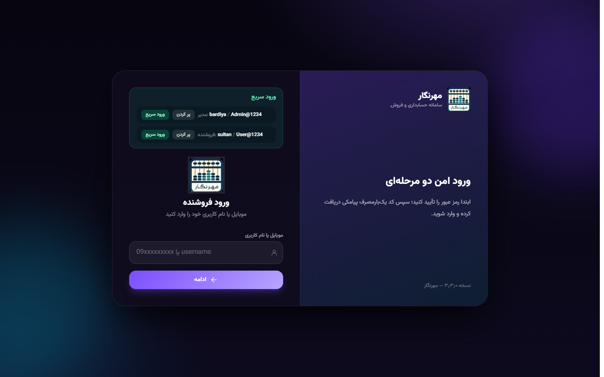

# مهرنگار — Demo

نسخه نمایشی **مهرنگار**؛ سامانه حسابداری و فروش فروشگاهی با Backend در حافظه — بدون نیاز به PostgreSQL یا سرویس خارجی.



## معرفی

این مخزن نسخهٔ مستقل Demo مهرنگار است. رابط کاربری مشابه محصول اصلی است و برای آزمایش جریان‌های فروش، انبار، گزارش و تنظیمات طراحی شده است. داده‌ها در حافظه نگه‌داری می‌شوند و با restart سرور بازنشانی می‌شوند.

## امکانات

- Dashboard، محصولات، ثبت فروش، فاکتور، مرجوعی
- مشتریان، انبارها، انبارگردانی، توزیع
- گزارش‌های مالی، فروش و موجودی
- کاربران، تنظیمات، پیامک (Mock)
- ورود دو مرحله‌ای (OTP Mock)
- RTL فارسی، Dark/Light، Responsive

## تکنولوژی‌ها

- Next.js 16 · React 19 · TypeScript
- In-memory Mock Backend
- Tailwind CSS 4

## نصب و اجرا

```bash
npm install
npm run dev
```

مرورگر: [http://localhost:3000](http://localhost:3000)

### حساب‌های ورود

| نقش | نام کاربری | رمز |
|-----|------------|-----|
| مدیر | `mehrnegaradmin` | `Admin@1234` |
| فروشنده | `mehrnegaruser` | `User@1234` |

- **ورود سریع:** دکمه‌های صفحه Login
- **OTP:** پس از وارد کردن نام کاربری و رمز → کد **`12345`**

## اجرای تست‌ها

```bash
npm run lint
npm run typecheck
```

## Build و Deploy

```bash
npm run build
npm start
```

برای Vercel: Framework **Next.js** — Environment Variable لازم نیست.

## Screenshotها


